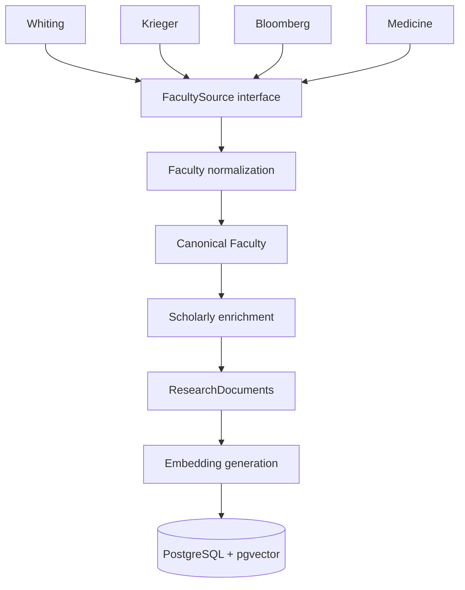
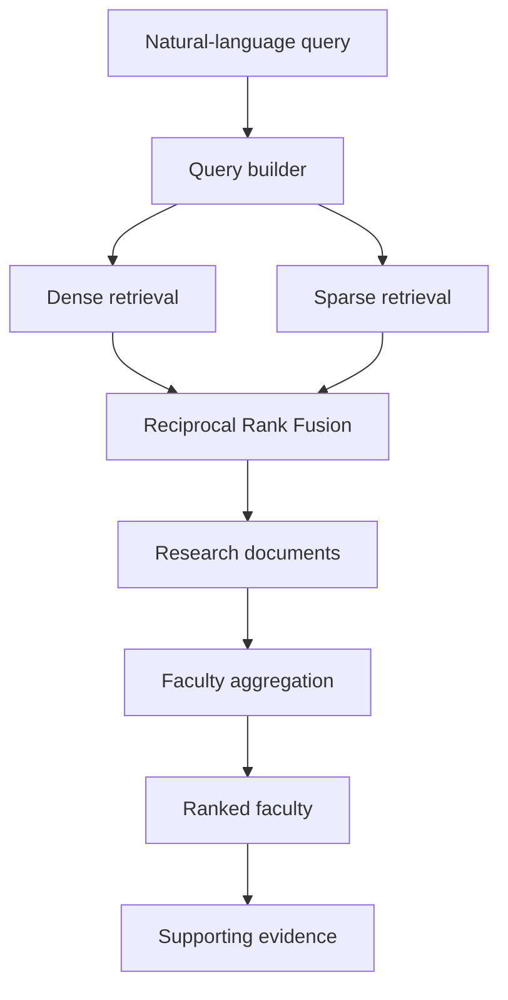
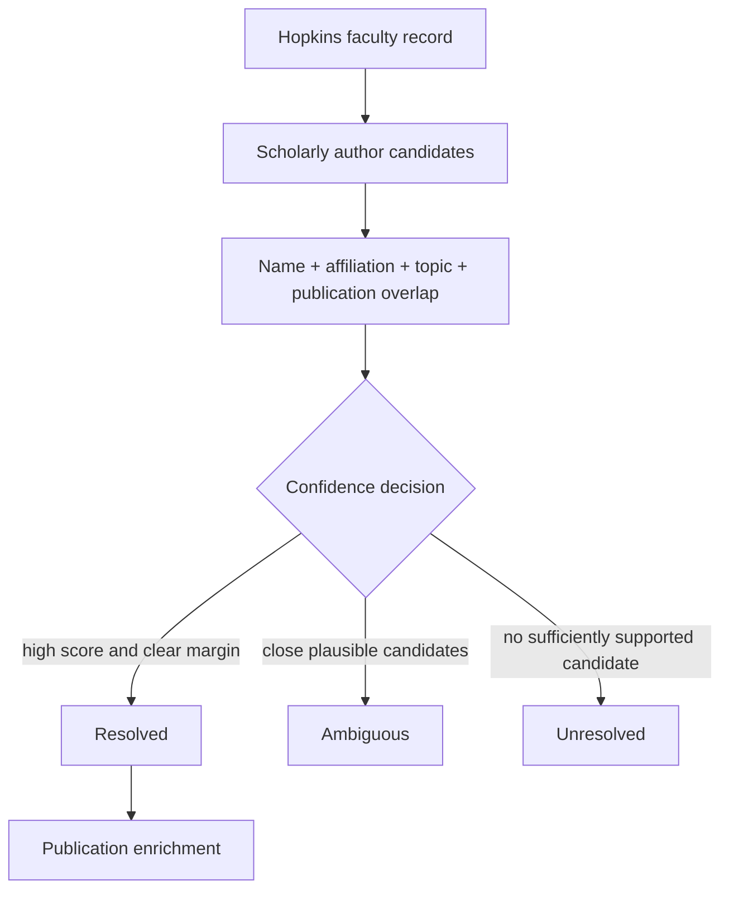
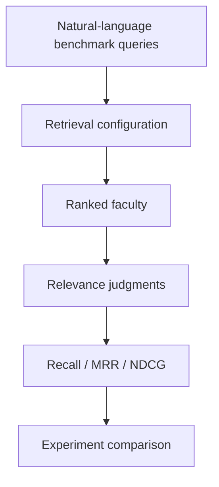
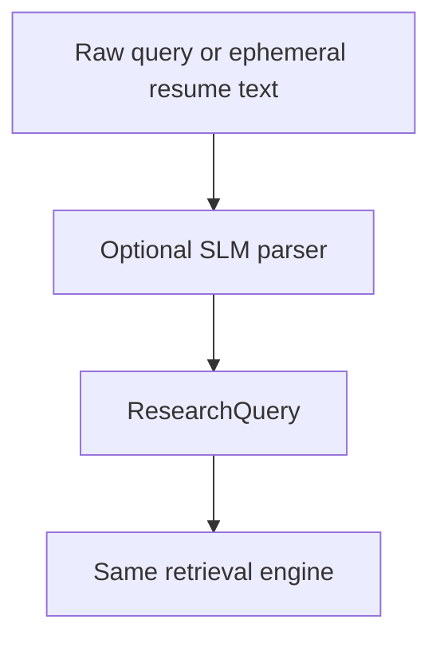

# ResearchQuery — MVP Design and Operating Manual

**Document role:** Long-term source of truth for short-context coding agents  
**Project:** ResearchQuery  
**Status:** Design baseline; implementation has not started  
**Current phase:** Phase 1 — Research Corpus  
**Last updated:** 2026-09-13

Before changing this repository, read this document in full. If code and this document disagree, stop and determine whether the code is an intentional, recorded architectural change. Update the relevant ADR and this document in the same change; do not silently let the design drift.

## 1. Product goal and success criterion

ResearchQuery helps Johns Hopkins students find current Hopkins faculty whose research aligns with the students' natural-language interests, desired methods, coursework, skills, and academic background. It returns faculty together with the actual Hopkins or scholarly research documents that caused each result to rank.

The central MVP question is:

> Can natural-language student research interests retrieve the correct Johns Hopkins researchers?

For example, a query such as:

> I want to do machine learning applied to materials science, especially generative models or molecular simulation. I've taken ML, probability, and physics.

should produce ranked faculty and evidence such as a recent publication about generative crystal discovery, a lab description mentioning molecular simulation, or a current faculty research statement about ML-driven materials design.

The product is a transparent retrieval system, not a recommender platform. Its governing sequence is:

> Build the corpus, make retrieval work, prove retrieval works, then build the demo.

### 1.1 Scope principle

ResearchQuery targets research faculty across Johns Hopkins, including Whiting, Krieger, Bloomberg, Medicine, APL, and other useful Hopkins institutes or divisions. Coverage grows one school or unit at a time behind a common adapter contract.

> Broad institutional scope, narrow incremental implementation.

Whiting School of Engineering is the first and reference adapter. It must become reliable before another school is added. Completing every Hopkins school is not a prerequisite for beginning retrieval work once the Whiting corpus is useful.

### 1.2 MVP includes

- School-specific Hopkins faculty ingestion, beginning with Whiting.
- Canonical faculty normalization and multi-unit affiliation handling.
- Conservative scholarly-author resolution and recent-publication enrichment.
- Multiple independently searchable research documents per faculty member.
- Offline local embeddings, dense retrieval, PostgreSQL lexical retrieval, RRF fusion, and deterministic faculty aggregation.
- Raw natural-language input and optional manually structured fields.
- Evidence-bearing faculty results and transparent debug output.
- Offline relevance evaluation and corpus-coverage measurement.
- A thin Streamlit demo.
- Optionally, late in Phase 4, ephemeral resume-to-query conversion.

### 1.3 Explicitly out of scope

Do not add any of the following to the MVP:

- Cross-encoder, LLM, SLM, or any other reranking stage.
- LambdaMART, LightGBM, learned fusion, or learned ranking.
- Collaborative filtering, two-tower recommendation, behavioral personalization, or recommendation feeds.
- Accounts, authentication, persistent student profiles, social features, messaging, availability prediction, or automated outreach.
- Agent frameworks or model-directed retrieval orchestration.
- A required generative model anywhere in normal search.
- Permanent GPU infrastructure, Kubernetes, microservices, or a dedicated vector database.
- A production frontend/backend split such as Next.js plus FastAPI.
- One giant Hopkins scraper or empty placeholder adapters for schools not being integrated.

Most importantly, **there is no reranking stage in the MVP**. Final order comes from retrieval, RRF, and deterministic faculty aggregation.

## 2. System invariants

These rules are architectural constraints, not suggestions:

1. Hopkins-owned sources determine whether a person is current Hopkins faculty and provide authoritative institutional affiliation metadata.
2. Scholarly APIs enrich canonical Hopkins records; they never establish Hopkins membership.
3. A faculty member is represented by multiple research documents, never one averaged professor embedding.
4. Retrieval ranks documents first and groups them into faculty second.
5. Every searchable document retains source provenance.
6. Low-confidence scholarly-author matches remain `ambiguous` or `unresolved`; they never receive silently attached publications.
7. Raw natural-language queries remain a supported direct input to both dense and sparse retrieval.
8. The normal query path contains no LLM or SLM and can operate with `LLM_PROVIDER=none`.
9. Ranking is deterministic for fixed corpus, configuration, model artifacts, and query.
10. UI code calls the search service and contains no retrieval logic.
11. School-specific parsing remains inside `FacultySource` adapters; scholarly-provider details remain inside `PublicationSource` adapters.
12. Every retrieval change must be measurable on the offline benchmark.
13. Records are deactivated or superseded rather than destructively erased during routine refreshes.

## 3. Architecture overview

The core product flow is:

```text
Hopkins faculty sources
        ↓
faculty normalization
        ↓
canonical faculty + affiliations
        ↓
optional publication enrichment
        ↓
ResearchDocuments
        ↓
offline embeddings + lexical index
        ↓
raw natural-language query
        ↓
dense retrieval + sparse retrieval
        ↓
Reciprocal Rank Fusion
        ↓
deterministic faculty aggregation
        ↓
ranked faculty + retrieved evidence
```

### 3.1 Multi-school corpus construction



Only `WhitingFacultySource` exists initially. Later adapters emit the same `RawFacultyRecord` and cannot require changes to retrieval.

### 3.2 Search



### 3.3 Deployment shape

The MVP is one Python package, one PostgreSQL database with pgvector, command-line ingestion/evaluation scripts, and one Streamlit process. Embeddings run offline during ingestion and once per query during search. CPU execution is the baseline. No service boundary is introduced merely in anticipation of a future web product.

## 4. Repository shape

Create files only when their phase or task is active. The intended compact layout is:

```text
ResearchQuery/
├── ELEPHANT.md
├── README.md
├── pyproject.toml
├── .env.example
├── migrations/
├── src/research_query/
│   ├── config.py
│   ├── data/
│   │   ├── models.py
│   │   ├── database.py
│   │   └── repositories.py
│   ├── ingestion/
│   │   ├── faculty/
│   │   │   ├── base.py
│   │   │   └── whiting.py
│   │   ├── publications/
│   │   │   ├── base.py
│   │   │   └── semantic_scholar.py
│   │   ├── normalize.py
│   │   ├── author_resolution.py
│   │   └── pipeline.py
│   ├── documents/builder.py
│   ├── embeddings/model.py
│   ├── query/
│   │   ├── schema.py
│   │   └── builder.py
│   ├── retrieval/
│   │   ├── dense.py
│   │   ├── sparse.py
│   │   ├── hybrid.py
│   │   └── aggregate.py
│   ├── search/service.py
│   └── evaluation/
│       ├── metrics.py
│       ├── benchmark.py
│       ├── coverage.py
│       └── experiments.py
├── app/streamlit_app.py
├── scripts/
│   ├── ingest.py
│   ├── embed.py
│   └── evaluate.py
├── data/
│   ├── raw/
│   ├── processed/
│   └── evaluation/
└── tests/
```

Do not pre-create `krieger.py`, `bloomberg.py`, or other adapters. Add each only when that source is actively integrated. Database migrations are explicit and committed. Raw crawl snapshots and generated model artifacts should be ignored unless deliberately added as small test fixtures.

## 5. Domain contracts

Use typed Python data classes or equivalent validation models at module boundaries. ORM rows must not leak into source adapters or UI code.

### 5.1 Faculty source contract

```python
from dataclasses import dataclass, field
from typing import Iterable, Mapping, Protocol

@dataclass(frozen=True)
class RawFacultyRecord:
    source_name: str
    source_faculty_key: str
    source_url: str
    name: str
    title: str | None = None
    school: str | None = None
    department: str | None = None
    profile_url: str | None = None
    lab_url: str | None = None
    research_areas: tuple[str, ...] = ()
    research_summary: str | None = None
    biography: str | None = None
    external_identifiers: Mapping[str, str] = field(default_factory=dict)
    source_payload: Mapping[str, object] = field(default_factory=dict)

class FacultySource(Protocol):
    source_name: str

    def fetch_faculty(self) -> Iterable[RawFacultyRecord]: ...
```

`source_faculty_key` is the adapter's most stable identifier: a Hopkins directory ID when available, otherwise a canonicalized Hopkins profile URL. Pagination, individual-page enrichment, selectors, and source-specific retries remain inside the adapter. The adapter emits records; it does not write canonical faculty, resolve scholarly authors, build embeddings, or know about retrieval.

### 5.2 Publication source contract

```python
@dataclass(frozen=True)
class AuthorCandidate:
    source_name: str
    author_id: str
    name: str
    affiliations: tuple[str, ...]
    topics: tuple[str, ...]
    known_papers: tuple["PublicationRecord", ...]

@dataclass(frozen=True)
class PublicationRecord:
    source_name: str
    external_id: str
    title: str
    abstract: str | None
    year: int | None
    publication_date: str | None
    url: str | None
    doi: str | None
    authors: tuple[str, ...]
    metadata: Mapping[str, object]

class PublicationSource(Protocol):
    source_name: str

    def find_authors(self, faculty: "FacultyForResolution") -> list[AuthorCandidate]: ...
    def get_publications(
        self, author_id: str, *, limit: int, start_year: int | None
    ) -> list[PublicationRecord]: ...
```

Provider responses are mapped to these types at the boundary. The ingestion pipeline owns confidence decisions and persistence. Semantic Scholar is first; OpenAlex may later implement the same interface.

### 5.3 Query and result contracts

```python
@dataclass(frozen=True)
class ResearchQuery:
    free_text: str | None = None
    research_interests: tuple[str, ...] = ()
    methods: tuple[str, ...] = ()
    background: tuple[str, ...] = ()

@dataclass(frozen=True)
class SupportingDocument:
    document_id: UUID
    document_type: str
    title: str
    snippet: str
    publication_year: int | None
    source_name: str
    source_url: str
    dense_rank: int | None
    sparse_rank: int | None
    fused_rank: int
    fused_score: float

@dataclass(frozen=True)
class FacultySearchResult:
    faculty_id: UUID
    faculty_name: str
    title: str | None
    departments: tuple[str, ...]
    schools: tuple[str, ...]
    profile_url: str
    lab_url: str | None
    faculty_score: float
    supporting_documents: tuple[SupportingDocument, ...]
```

The query object is request-scoped normalization, not a student profile. `QueryBuilder.build()` trims and de-duplicates nonempty values. If `free_text` exists it is retained verbatim, followed by deterministic labeled lines for any structured fields:

```text
<free text>
Research interests: item one; item two.
Methods: method one; method two.
Background: course or skill one; course or skill two.
```

If only structured fields exist, omit the blank first line. Reject an all-empty query. The resulting single string goes to both retrievers; no semantic extraction is required.

### 5.4 Retrieval interfaces

```python
@dataclass(frozen=True)
class RankedDocument:
    document_id: UUID
    faculty_id: UUID
    rank: int
    score: float
    channel: str  # "dense", "sparse", or "hybrid"
    channel_ranks: Mapping[str, int]

class DenseRetriever(Protocol):
    def search(self, query_text: str, *, limit: int) -> list[RankedDocument]: ...

class SparseRetriever(Protocol):
    def search(self, query_text: str, *, limit: int) -> list[RankedDocument]: ...

class HybridRetriever(Protocol):
    def fuse(
        self,
        dense: list[RankedDocument],
        sparse: list[RankedDocument],
        *, limit: int,
    ) -> list[RankedDocument]: ...

class FacultyAggregator(Protocol):
    def aggregate(
        self, documents: list[RankedDocument], *, limit: int
    ) -> list[FacultySearchResult]: ...
```

The orchestration in `SearchService.search()` should stay visibly linear:

```python
query_text = query_builder.build(query)
dense = dense_retriever.search(query_text, limit=settings.dense_top_k)
sparse = sparse_retriever.search(query_text, limit=settings.sparse_top_k)
documents = hybrid_retriever.fuse(
    dense, sparse, limit=settings.hybrid_top_k
)
return faculty_aggregator.aggregate(
    documents, limit=settings.faculty_top_k
)
```

## 6. Relational data model

PostgreSQL is the source of truth. Use UUID primary keys, UTC `timestamptz`, JSONB only for provider-specific extras, and database constraints for uniqueness. The logical schema is minimal but separates canonical identity from source observations and affiliations.

### 6.1 `faculty`

| Column | Type | Rules / purpose |
|---|---|---|
| `faculty_id` | `uuid` | Primary key; generated once when canonical identity is created. |
| `name` | `text` | Current display name from the preferred Hopkins source. |
| `normalized_name` | `text` | Unicode-normalized, case-folded comparison form; not a unique key. |
| `title` | `text null` | Preferred current Hopkins title. |
| `profile_url` | `text` | Preferred canonical Hopkins profile URL. |
| `lab_url` | `text null` | Clearly identified lab URL only. |
| `research_summary` | `text null` | Current Hopkins research statement when available. |
| `is_active` | `boolean` | Current institutional status; default true. |
| `external_scholar_author_id` | `text null` | Resolved ID for the configured primary scholarly source. |
| `author_resolution_status` | enum/text | `unresolved`, `ambiguous`, or `resolved`. |
| `author_resolution_confidence` | `double precision null` | Stored score for audit, not retrieval. |
| `created_at` | `timestamptz` | First canonical creation. |
| `updated_at` | `timestamptz` | Last canonical change. |

For convenient display, school and department are derived from active affiliations rather than duplicated as a lossy single value. If an ORM needs `primary_school` and `primary_department` properties, implement them as derived properties, not independent facts.

### 6.2 `faculty_affiliations`

| Column | Type | Rules / purpose |
|---|---|---|
| `affiliation_id` | `uuid` | Primary key. |
| `faculty_id` | `uuid` | Foreign key to `faculty`, cascade only on explicit canonical deletion. |
| `school` | `text` | Normalized institutional school/unit name. |
| `department` | `text null` | Normalized department or center. |
| `title` | `text null` | Unit-specific title if supplied. |
| `is_primary` | `boolean` | At most one primary active affiliation per faculty. |
| `is_active` | `boolean` | Soft status for historical affiliations. |
| `source_record_id` | `uuid` | Provenance link. |
| `created_at`, `updated_at` | `timestamptz` | Audit timestamps. |

Unique active identity is enforced on `(faculty_id, school, coalesce(department, ''))`. This table prevents duplicate faculty results while preserving professors listed by multiple Hopkins units.

### 6.3 `faculty_source_records`

| Column | Type | Rules / purpose |
|---|---|---|
| `source_record_id` | `uuid` | Primary key. |
| `faculty_id` | `uuid` | Canonical identity selected by normalization. |
| `source_name` | `text` | For example `whiting`. |
| `source_faculty_key` | `text` | Stable adapter-provided identity key. |
| `source_url` | `text` | Discovery or record URL. |
| `profile_url` | `text null` | Observed profile URL. |
| `raw_payload` | `jsonb` | Parsed source fields needed for audit; avoid unnecessary page content. |
| `content_hash` | `text` | Detect unchanged records. |
| `last_seen_at` | `timestamptz` | Last successful complete snapshot containing it. |
| `missing_run_count` | `integer` | Consecutive complete snapshots where absent. |
| `is_active` | `boolean` | Soft source-observation status; default true. |
| `created_at`, `updated_at` | `timestamptz` | Audit timestamps. |

`(source_name, source_faculty_key)` is unique. It is the principal upsert key. A canonical faculty may own many source records. Cross-source merging is explicit and auditable; never merge common names on name alone. If an adapter supplies no separate profile URL, normalization uses its authoritative Hopkins `source_url` as the canonical faculty profile URL.

### 6.4 `research_documents`

| Column | Type | Rules / purpose |
|---|---|---|
| `document_id` | `uuid` | Stable deterministic primary key. |
| `faculty_id` | `uuid` | Owning faculty; indexed foreign key. |
| `document_type` | enum/text | `faculty_research`, `faculty_bio`, `lab_description`, or `publication`. |
| `title` | `text` | Human-readable evidence title. |
| `text` | `text` | Searchable body; may be empty only for a useful title-only publication. |
| `publication_year` | `smallint null` | Publication year where applicable. |
| `source_url` | `text` | Evidence destination; required. For scholarly records, construct the provider's canonical paper URL from its ID when necessary. |
| `source_name` | `text` | Hopkins adapter or scholarly provider. |
| `external_id` | `text` | Stable source-level content identity. |
| `chunk_key` | `text` | `whole` for unsplit content, otherwise stable source-local section/chunk key. |
| `metadata` | `jsonb` | DOI, authors, venue, affiliation context, content hash, and provider extras. |
| `search_vector` | `tsvector` | Stored/generated weighted lexical representation. |
| `embedding` | `vector(768)` | Nullable until embedded; L2-normalized BGE vector. |
| `embedding_model` | `text null` | Exact model/revision used. |
| `embedding_content_hash` | `text null` | Hash of formatted embedding input. |
| `is_active` | `boolean` | Excluded from search when false. |
| `created_at`, `updated_at` | `timestamptz` | Audit timestamps. |

Unique constraint: `(faculty_id, source_name, external_id, chunk_key)`. There is intentionally no separate Publication table: publication title, abstract text, year, DOI, author list, venue, IDs, and provenance fit cleanly in a `publication` ResearchDocument. Add a Publication table only if later non-retrieval relations require it.

The lexical vector weights title as `A` and body text as `B`. Metadata is not broadly indexed; explicitly promote a field only after evaluation shows value.

### 6.5 Optional operational tables

`ingestion_runs` is allowed in Phase 1 because safe deactivation and debugging require knowing whether a source snapshot completed. Store run ID, source, start/end, status, counts, configuration, and error summary. `author_resolution_attempts` is also allowed if JSON logs are insufficient; it records candidates, feature evidence, score, decision, and resolver version. Neither participates in search.

## 7. Stable identity, deduplication, and upserts

### 7.1 Faculty identity

- Generate `faculty_id` once (UUIDv7/UUID4) when a canonical Hopkins identity is first created; stability comes from persistence, not from a mutable name.
- Upsert a source observation by unique `(source_name, source_faculty_key)` and preserve its existing `faculty_id`.
- On a new source record, first match an exact previously seen canonicalized Hopkins profile URL or explicit Hopkins identifier. Otherwise require a reviewed multi-signal institutional match (normalized name plus compatible unit/title/profile evidence). Name alone never auto-merges.
- If identity remains uncertain, create a separate canonical record and flag it for possible merge. A false duplicate is safer than merging two people and contaminating publications.
- A later explicit merge chooses one surviving `faculty_id`, repoints affiliations/source records/documents transactionally, records the alias/tombstone, and preserves external references. Routine ingestion never performs destructive merging.

### 7.2 Document identity

Generate UUIDv5 `document_id` from the namespace `researchquery-document-v1` and:

```text
faculty_id | source_name | external_id | chunk_key
```

For Hopkins page sections, `external_id` is an explicit source content ID or canonical URL plus semantic section type. For publications, prefer DOI, then provider paper ID, then `normalized_title|year`. `chunk_key` is `whole` unless the source is split. Changes to title, abstract, or page copy update the same row, invalidate its embedding hash, and do not create a duplicate.

Publication deduplication within one faculty uses DOI first, then provider ID, then normalized title plus year. The same paper may correctly exist once per faculty owner because each document is evidence for a different faculty result.

### 7.3 Refresh and deletion policy

- Each adapter run writes source records and their dependent Hopkins documents in a transaction-sized batch with checkpoints.
- Unchanged content hashes skip document rebuilding and re-embedding.
- A failed or partial crawl never marks missing faculty inactive.
- After **two consecutive successful complete snapshots** omit a source record, mark that source record and its source-dependent documents inactive. Mark the canonical faculty inactive only when no active Hopkins source record remains.
- Reappearance reactivates the existing identities.
- Scholarly publications missing from a refresh are not immediately deleted; deactivate only after a successful complete author fetch and a configurable grace policy. Policy changes must not change stable document IDs.
- Preserve old records for audit; normal search always filters `is_active=true` and `embedding is not null` for dense search.

## 8. Ingestion architecture and policy

### 8.1 Pipeline

For each enabled source:

1. Start an ingestion run and fetch the directory with respectful rate limits, a descriptive user agent, bounded concurrency, timeouts, retries with jitter, and provider caching.
2. Optionally fetch authoritative individual Hopkins pages discovered by the adapter.
3. Persist the raw parsed `RawFacultyRecord` and provenance before normalization.
4. Normalize whitespace, Unicode, names for comparison, canonical URLs, school names, department names, and lists. Preserve the display spelling from Hopkins.
5. Resolve each source record to a canonical Faculty and upsert affiliations.
6. Build Hopkins `faculty_research`, `faculty_bio`, and clearly attributable `lab_description` documents.
7. Resolve the scholarly author conservatively. Reuse a persisted resolved ID unless validation indicates drift.
8. For resolved authors only, fetch and select recent publications, deduplicate them, and build publication documents.
9. Embed new or changed active documents.
10. Mark the snapshot complete, apply absence policy, and report counts and errors.

Retries should cover transient `429`, `5xx`, and connection failures with exponential backoff and honor `Retry-After`. Permanent record errors are logged with faculty/source context and do not abort unrelated records. Authentication/configuration errors fail the run. Cache scholarly responses during a run and respect provider terms and quotas. Do not aggressively crawl personal sites; lab content is accepted only from clearly linked, publicly accessible pages and remains lower-authority research evidence, not identity evidence.

### 8.2 Source precedence and field conflicts

Institutional values are selected deterministically:

1. Explicit Hopkins person profile.
2. Hopkins school directory record.
3. Hopkins center/institute listing.
4. External lab page, only for lab URL/description.
5. Scholarly provider, only for scholarly metadata.

Conflicting observations remain in `faculty_source_records`. The preferred display field follows precedence, then most recently observed value. Affiliations are additive rather than overwritten. Scholarly titles or affiliations never overwrite Hopkins faculty identity.

### 8.3 Edge-case behavior

| Condition | Required behavior |
|---|---|
| Duplicate faculty listings | Map source records to one canonical faculty only with strong institutional evidence; retain all affiliations and provenance. |
| Common name | Do not merge or resolve scholarly identity from name alone. |
| Missing research summary | Keep the faculty; use other available Hopkins evidence and any confidently resolved publications. |
| Missing lab website | Store null; do not search broadly for a guessed site. |
| No scholarly match | Set `unresolved`; keep Hopkins documents searchable. |
| Ambiguous scholarly match | Set `ambiguous`, store candidate evidence, attach no publications. |
| Missing publication abstract | Prefer abstract-bearing papers during selection; a useful title-only paper may be indexed with empty body and marked in metadata. |
| Duplicate publication | Deduplicate per faculty by DOI/provider ID/title-year hierarchy. |
| Faculty listed in many units | One faculty result, many affiliations/source records. |
| Faculty leaves Hopkins | Apply two-complete-snapshot deactivation; retain history and documents inactive. |
| External request fails | Retry boundedly, log provenance/context, keep prior good data active, and mark run partial if completeness is unknown. |

## 9. Scholarly-author resolution

Author resolution is a data-quality gate, not retrieval. It produces one of `resolved`, `ambiguous`, or `unresolved` and an auditable explanation.



### 9.1 Candidate generation

Search the provider using normalized full name plus Hopkins/Johns Hopkins and, when useful, department or known paper titles. Retain a bounded candidate set. Exact name similarity is necessary for automatic resolution unless an explicit external identifier exists, but it is never sufficient.

### 9.2 Initial explainable scorer

The resolver records raw feature evidence and computes a versioned score in `[0, 1]`:

| Signal | Initial maximum | Examples |
|---|---:|---|
| Name agreement | 0.30 | Full name, initials, known variants; penalize contradictory middle names. |
| Hopkins affiliation | 0.25 | Current or historical Johns Hopkins affiliation from provider data. |
| Known publication overlap | 0.25 | DOI or normalized-title overlap with publications named on a Hopkins page. |
| Topic/department agreement | 0.15 | Candidate topics/papers agree with Hopkins research and unit. |
| Coauthor or external-ID evidence | 0.05 | Known collaborators or ORCID/provider ID exposed by Hopkins. |

Hard contradictions, such as a clearly different field and institution combined with no overlap, disqualify a candidate. An explicit Hopkins-exposed provider ID or ORCID mapped unambiguously may resolve directly after validation.

Initial automatic decision policy:

- `resolved`: best score at least `0.80`, margin over second candidate at least `0.15`, name gate passes, and at least one strong non-name signal exists.
- `ambiguous`: at least one plausible candidate scores `0.60` or higher but the resolve threshold, margin, or non-name evidence requirement fails.
- `unresolved`: no plausible candidate reaches `0.60`, or no candidate exists.

Thresholds and weights are configuration/versioned policy, not hidden constants. Tune them on a manually reviewed resolution set, prioritizing precision over coverage. Manual decisions store resolver version `manual`, evidence, and reviewer/time; ingestion must not overwrite them without explicit invalidation.

### 9.3 Persisted resolution validation

On later runs, reuse the resolved scholarly author ID to avoid repeated search, but verify that the provider record still exists and its name is compatible. A validation failure changes the state to `ambiguous` or `unresolved`, leaves previously fetched publications inactive or quarantined according to policy, and requests review. Never silently switch from one author ID to another.

## 10. Research document construction

Each document is independently searchable and owned by exactly one faculty member. Do not average document vectors into a professor vector.

### 10.1 Canonical forms

Faculty research document:

```text
Title: Jane Doe — Research Interests
Text: Jane Doe studies machine learning methods for computational materials science…
```

Publication document:

```text
Title: Generative Models for Crystal Discovery
Text: <abstract, when available>
```

The displayed title and body are stored separately. The embedding formatter uses a deterministic representation such as `Title: {title}\nText: {text}`. It must not synthesize claims or add keywords not present in the source.

### 10.2 Chunking rules

- A publication title plus abstract is always one document.
- Keep a faculty research statement, faculty bio, or lab page as one document when its cleaned body is at most 1,200 model tokens.
- For longer pages, split first on semantic headings/paragraph boundaries into chunks targeting 600–900 tokens, with a hard maximum of 1,200 and at most 100 tokens of paragraph-boundary overlap.
- Never split a paragraph merely to hit the target unless it exceeds the hard maximum.
- Every chunk repeats a concise source title, receives a stable source-local `chunk_key`, and links to the source page.
- Remove navigation, repeated headers/footers, contact boilerplate, cookie text, and unrelated news listings. Preserve meaningful section headings.
- Do not chunk short content or manufacture multiple near-duplicate documents to increase a faculty member's score.

Store extractor version and cleaned-content hash in metadata so changes are auditable and embeddings can be invalidated correctly.

### 10.3 Publication selection default

For each resolved faculty author, consider approximately the last **7 years**, order newest first, prefer records with abstracts, and index at most **15** publications. Include a title-only paper only when needed to fill the limit and the title is substantive. Both `PUBLICATION_LOOKBACK_YEARS=7` and `MAX_PUBLICATIONS_PER_FACULTY=15` are configurable and must be evaluated. Do not build a publication-selection model.

## 11. Embeddings and dense retrieval

### 11.1 Default model

Use `BAAI/bge-base-en-v1.5` at a pinned model revision through a replaceable `EmbeddingModel` interface.

```python
class EmbeddingModel(Protocol):
    model_id: str
    dimension: int

    def embed_query(self, text: str) -> list[float]: ...
    def embed_documents(self, documents: list[str]) -> list[list[float]]: ...
```

`LocalEmbeddingModel` is the only required implementation. A future `ExternalEmbeddingModel` may implement the same contract for controlled experiments; neither retrieval nor persistence may depend on a provider-specific SDK.

| Property | MVP default |
|---|---|
| Dimension | 768 |
| Execution | Local CPU baseline; batching offline; GPU optional for one-off acceleration only. |
| Vector normalization | L2-normalize document and query embeddings. |
| Similarity | Cosine similarity, implemented as inner product on normalized vectors. |
| Query formatting | `Represent this sentence for searching relevant passages: {query_text}` |
| Document formatting | `Title: {title}\nText: {text}` with no query instruction. |
| Precision | `float32` unless measured storage/performance needs justify a change. |

The fixed BGE instruction is deterministic embedding formatting, not LLM parsing or expansion. The student's raw meaning is sent directly to the embedding model. Store exact model name/revision and formatted-input hash with every vector. A model change requires a new embedding version and full re-embedding before comparison.

The corpus—several thousand faculty times roughly 10–20 documents—is small enough for CPU embedding and query inference. Core paid AI inference cost is `$0`.

### 11.2 Vector search

Start with exact pgvector search:

```sql
ORDER BY embedding <#> :normalized_query_vector
```

over active, embedded documents, translating negative inner product to a higher-is-better diagnostic score. At expected MVP scale, exact search is simpler and likely sufficient. Add an HNSW cosine/inner-product index only after measured query latency exceeds the agreed budget; record build parameters and recall comparison. Do not add a separate vector database.

Dense retrieval returns the top `DENSE_TOP_K=50`, with stable tie-breaking by `document_id`.

## 12. Sparse retrieval

Use PostgreSQL full-text search first. Maintain a stored `tsvector` with English parsing, title weight `A`, and body weight `B`; create a GIN index. Convert the same query text with `websearch_to_tsquery('english', ...)` and rank using `ts_rank_cd`. Normalize or alias punctuation-heavy acronyms during indexing/query construction only with deterministic, tested rules; do not silently expand domain terminology.

Sparse retrieval exists because exact terms such as `DFT`, `LAMMPS`, `CRISPR`, `Raman spectroscopy`, `graph neural networks`, and `Bayesian optimization` may be diluted in semantic search. It returns `SPARSE_TOP_K=50`, sorted by rank descending and `document_id` for ties.

PostgreSQL FTS is the default because it shares storage and operations with the corpus. If evaluation shows materially worse recall than a true BM25 implementation, a lightweight in-process or PostgreSQL-compatible BM25 alternative may be tested. Elasticsearch/OpenSearch is out of scope.

## 13. Hybrid fusion and faculty aggregation

### 13.1 Reciprocal Rank Fusion

Fuse dense and sparse ranks, not their incomparable raw scores:

```text
rrf(document) = Σ channel∈{dense,sparse} 1 / (RRF_K + rank_channel(document))
```

Use one-based ranks, `RRF_K=60`, dense top 50, sparse top 50, and retain `HYBRID_TOP_K=100`. A document absent from a channel contributes zero for it. Sort by fused score descending, then best channel rank, then `document_id`. Preserve both channel ranks and raw diagnostic scores. Do not train weights.

### 13.2 Faculty aggregation

Group fused documents by `faculty_id`. Sort each faculty's evidence by fused score and keep the top three distinct documents. Compute:

```text
faculty_score = 0.60 × best_rrf
              + 0.30 × second_rrf
              + 0.10 × third_rrf
```

Missing positions contribute zero. This rewards one excellent match while allowing corroborating evidence to distinguish faculty and limiting prolific-author domination. Return at most `FACULTY_TOP_K=10`. Break ties by best supporting-document rank, then normalized faculty name, then `faculty_id`.

Do not add document-type boosts initially. Do not let multiple near-identical chunks from the same source section occupy more than one of the three supporting slots; collapse them by `(source_name, external_id)` for aggregation while retaining raw retrieval diagnostics.

Publication recency weighting is **off by default**. A future experiment may multiply publication RRF contributions by a bounded, documented decay; faculty research, bio, and lab documents never receive age decay. Search must work without recency.

### 13.3 Evidence and snippets

Results show faculty name/title, all active school and department affiliations, Hopkins profile, lab link if present, score, and the top supporting documents. Each evidence item contains type, title, year, source link, deterministic snippet, fused rank/score, and optionally dense/sparse ranks in debug mode.

Generate snippets without an LLM: select the highest lexical-overlap sentence window when overlap exists, otherwise the leading informative 240–320 characters; escape markup and mark truncation. The retrieved source text itself is the explanation. Do not generate “Professor X is a strong match because…” in the MVP.

## 14. Configuration

Use one typed settings object loaded from environment variables and validated at startup. Defaults belong in configuration, not scattered through modules.

```text
DATABASE_URL
ENABLED_FACULTY_SOURCES=whiting

EMBEDDING_MODEL=BAAI/bge-base-en-v1.5
EMBEDDING_MODEL_REVISION=<pinned revision>
EMBEDDING_BATCH_SIZE=<CPU-safe measured default>

DENSE_TOP_K=50
SPARSE_TOP_K=50
HYBRID_TOP_K=100
FACULTY_TOP_K=10
RRF_K=60

MAX_PUBLICATIONS_PER_FACULTY=15
PUBLICATION_LOOKBACK_YEARS=7
AUTHOR_RESOLVE_THRESHOLD=0.80
AUTHOR_AMBIGUOUS_THRESHOLD=0.60
AUTHOR_RESOLVE_MARGIN=0.15

SEMANTIC_SCHOLAR_API_KEY=<optional/secret>
HTTP_USER_AGENT=<descriptive project contact>
HTTP_TIMEOUT_SECONDS
HTTP_MAX_RETRIES
```

Secrets never enter source control or logs. An external embedding provider, if ever tested, implements the same embedding interface and is opt-in. The architecture must function without an LLM provider setting.

## 15. Evaluation and failure analysis

Evaluation is a first-class subsystem. Retrieval configuration is not accepted because a few demos look plausible.

### 15.1 Benchmark data

Start with 30–50 student-style natural-language queries spanning schools, fields, specificity levels, acronyms, interdisciplinary topics, methods, and background statements; grow toward approximately 100. Include queries such as generative models for materials discovery, reinforcement learning for robotics, NLP for medicine, molecular simulation, quantum information, causal inference in public health, computational neuroscience, and transportation optimization.

Store a versioned, reviewable dataset under `data/evaluation/` containing:

- `query_id`, natural-language text, optional structured fields, topic tags, and notes.
- Faculty judgments on a four-level scale: `3=excellent`, `2=relevant`, `1=weak`, `0=irrelevant`.
- Judge identifier or adjudication status, timestamp, benchmark version, and corpus snapshot/version.
- A candidate-pool provenance field so unjudged results are distinguishable from judged-zero results.

Prefer judgments by domain-aware students/faculty or consensus of at least two reviewers for ambiguous cases. Build candidate pools from dense, sparse, and hybrid runs plus known faculty supplied by query authors. Randomize result presentation during judging. Do not treat unjudged documents as definitively irrelevant in analysis; report judgment coverage and manually adjudicate top unjudged results when comparing systems.

### 15.2 Metrics and unit of evaluation

Primary evaluation is at the **faculty** level after aggregation:

- Recall@5, Recall@10, Recall@20, where relevant means grade `>=2`. A query with no known relevant faculty is reported separately, not assigned zero recall.
- MRR, using the first faculty with grade `>=2`.
- NDCG@5 and NDCG@10 using graded relevance `0–3`.

Also retain document-level retrieval diagnostics, but do not substitute them for the faculty-level product outcome. Every result file records corpus snapshot, query-set version, judgment version, embedding model/revision, settings, code commit, and random seeds where applicable.

At minimum compare dense-only, sparse-only, and RRF hybrid using identical corpus, judgments, aggregation, and candidate limits. Report per-query values, macro means, confidence intervals (bootstrap is adequate), and regressions rather than only aggregate winners.

### 15.3 Evaluation flow



### 15.4 Coverage evaluation

Track corpus health separately by school and overall:

- Faculty count and active/inactive count.
- Percentage with a Hopkins research summary.
- Percentage with a lab description.
- Percentage resolved to a scholarly author.
- Percentage ambiguous and unresolved.
- Percentage with at least one recent publication abstract.
- ResearchDocument count and distribution per faculty by document type.
- Documents missing embeddings or source URLs.
- Crawl success, parse-error, and stale-record counts.

Pin expected directory counts or manually sampled source totals where available. Large count changes fail or warn during ingestion validation. Coverage dashboards must permit the question: did a faculty member rank poorly because retrieval failed, or because their relevant research was absent?

### 15.5 Failure taxonomy and debug traces

Every investigated miss is labeled as one or more of:

| Failure | Diagnostic question |
|---|---|
| Corpus failure | Was relevant research absent, stale, badly cleaned, or not embedded? |
| Identity-resolution failure | Was the scholarly author wrong, ambiguous, or unresolved? |
| Dense retrieval failure | Did the relevant document fall outside dense top K? |
| Sparse retrieval failure | Did tokenization/querying miss exact terminology? |
| Fusion failure | Was the document present in a channel but harmed by RRF? |
| Faculty aggregation failure | Was evidence retrieved but the owner ranked poorly after grouping? |
| Optional parser failure | Did a future parser omit or distort intent relative to raw input? |

An ingestion debug report must expose source/run, raw record, normalized fields, canonical identity decision, affiliations, author candidates/features/decision, publications fetched/selected/rejected, documents created/updated/deactivated, and embedding status.

A search debug report must expose the raw query object, built query text, embedding model/version, dense ranks/scores, sparse ranks/scores and parsed tsquery, per-document RRF terms, deduplication/collapse decisions, per-faculty weighted contributions, evidence selection, and final order. Debug data uses the same code path as normal search and contains no hidden model explanation.

### 15.6 Acceptance gates

Before claiming a retrieval improvement:

1. Run unit and end-to-end tests.
2. Run the fixed benchmark on the same corpus snapshot.
3. Report all required metrics and important per-query regressions.
4. Verify latency and coverage did not materially regress.
5. Record the experiment and decision, including rejected configurations.

Initial numeric quality targets should be set only after the first judged baseline; inventing a target now would not establish usefulness. Phase 3 is complete when configuration choices can be justified quantitatively and failures can be separated from missing corpus coverage.

## 16. Testing strategy

External Hopkins requests and scholarly APIs are mocked in unit tests using checked-in, minimized HTML/JSON fixtures. Never make live network calls in the default test suite.

### 16.1 Unit and contract tests

**Faculty ingestion**

- Parses representative Whiting directory/profile fixtures and normalizes fields.
- Preserves source URL, source key, raw provenance, Unicode display names, and multiple affiliations.
- Gives repeated identical input the same source/canonical IDs and no duplicate rows.
- Handles duplicate listings without merging unrelated common names.
- Leaves prior good records active on partial/failed pages.
- Applies two-complete-snapshot deactivation and reactivation correctly.
- Runs every adapter fixture through a shared `FacultySource` contract suite.

**Author resolution**

- Resolves exact, strongly corroborated candidates.
- Marks common-name/close-candidate cases ambiguous.
- Marks absent or weak candidates unresolved.
- Requires a non-name signal and threshold margin.
- Persists and reuses validated external author IDs.
- Never attaches publications for low-confidence states.
- Records feature evidence and resolver version.

**Publication ingestion**

- Deduplicates DOI, provider-ID, and normalized-title/year cases.
- Orders/selects by lookback, maximum count, and abstract preference.
- Correctly retains useful missing-abstract title records.
- Handles rate limits, transient failures, partial responses, and prior-data preservation.

**Research documents and embeddings**

- Produces stable IDs and correct faculty ownership.
- Preserves document type, URL, source, year, metadata, and chunk keys.
- Obeys chunk limits and removes boilerplate without losing meaningful headings.
- Changes content in place, invalidates the embedding hash, and embeds only changed/missing inputs.
- Stores normalized 768-dimensional vectors with exact model revision.

**Query builder**

- Handles raw-only, structured-only, combined, duplicate, whitespace, Unicode, and empty input.
- Produces a fixed field order and never paraphrases user text.

**Retrieval and aggregation**

- Dense retrieval ranks semantically related items in a tiny fixed corpus; isolate model-dependent tests and pin artifacts.
- Sparse retrieval finds exact scientific terms, acronyms, and phrases.
- RRF uses one-based ranks, handles channel-only hits, and resolves ties deterministically.
- Aggregation applies `0.60/0.30/0.10`, zero-fills missing evidence, collapses duplicate chunks, and uses deterministic ties.
- Inactive or unembedded documents and inactive faculty cannot surface.

### 16.2 Integration and end-to-end tests

Run database tests against a disposable PostgreSQL instance with the actual pgvector extension and migrations. Verify unique constraints, transactions, exact vector order, FTS behavior, idempotent re-ingestion, and rollback on failed complete snapshots.

An end-to-end synthetic fixture for:

```text
I want to use generative machine learning for materials science and molecular simulation.
```

must exercise query construction, dense and sparse retrieval, RRF, grouping, result formatting, and evidence links. Assert structural outcomes and intended relevant faculty, not brittle floating-point values except in isolated algorithm tests.

### 16.3 Evaluation regression tests

Metric functions use hand-calculated fixtures for Recall, reciprocal rank, and graded NDCG including ties, no-relevant-query handling, and cutoffs. The experiment runner must reproduce a saved run from pinned inputs. A small smoke subset can gate pull requests; the full benchmark runs before retrieval changes are accepted.

## 17. Minimal UI and optional parsing

Phase 4 adds a thin Streamlit page with a large natural-language text box, optional research-interest/method/background fields, a Search button, ranked faculty cards, school/department, Hopkins/lab links, and the top evidence documents. It calls `SearchService`; it does not issue SQL, embed text, fuse lists, or aggregate faculty itself.

Show actionable empty/error states: empty query validation, corpus not initialized, embedding model unavailable, and no results. Debug details may be placed behind a developer expander. Do not expose raw provider payloads or secrets.

### 17.1 Optional future query parser

An optional parser can be introduced only behind:

```python
class QueryParser(Protocol):
    def parse(self, text: str) -> ResearchQuery: ...
```

Possible implementations are `RuleBasedQueryParser`, `SmallLanguageModelQueryParser`, and `ExternalAPIQueryParser`. The parser is a preprocessor selected explicitly by configuration/UI; the unparsed raw-query path remains available as the control and permanent fallback.



This path is **optional and not part of core MVP search**. It advances only if controlled evaluation beats raw natural-language retrieval enough to justify complexity, latency, privacy, and possible inference cost.

### 17.2 Optional late-MVP resume input

If retained in Phase 4:

1. Accept PDF with strict size/type limits and safe text extraction.
2. Extract only research interests, scientific domains, methods, coursework, technical skills, and research/project topics.
3. Let the user inspect/edit the derived query before search.
4. Discard the uploaded file and extracted personal data after the request by default; do not persist resumes, contact details, addresses, or unrelated employment data.
5. Use the same `ResearchQuery` and search service. Resume support cannot become a second retrieval pipeline.

## 18. Cost, security, and operations boundaries

- Core AI API inference cost is `$0`: local embeddings plus deterministic retrieval and aggregation.
- Expected scale does not justify a permanent GPU or dedicated vector service. Hosting and PostgreSQL will dominate cost.
- Respect robots guidance, public access boundaries, provider terms, rate limits, and a descriptive contact user agent. Do not bypass access controls.
- Collect only public professional research data needed for retrieval. Provenance payloads should exclude irrelevant personal information.
- Sanitize source HTML, validate URLs, parameterize SQL, cap query/upload sizes, and never render untrusted markup directly.
- Log structured identifiers and outcomes, not secrets or full resume/query content by default. If query logging is later enabled for evaluation, obtain an explicit privacy policy and minimize/expire the data.
- Back up the relational corpus and migration state. Raw source snapshots are helpful for reproducibility but should have a documented retention policy.
- A refresh can be run manually initially. Scheduling and production SLOs are deferred until actual usage requires them.

## 19. Exactly four implementation phases

There are only four MVP phases. Tasks may be subdivided inside a phase, but no fifth architectural phase may be created.

### Phase 1 — Research Corpus

**Build**

- Initialize the Python repository and typed configuration.
- Configure PostgreSQL, migrations, and pgvector.
- Implement Faculty, source-record, affiliation, ingestion-run, and ResearchDocument persistence.
- Implement `FacultySource`, Whiting discovery/profile parsing, normalization, provenance, identity/upsert behavior, and tests.
- Implement `PublicationSource`, Semantic Scholar access, confidence-based author resolution, publication selection/deduplication, and tests.
- Implement document construction, the local embedding interface/model, incremental embedding, and corpus/ingestion inspection.
- Once Whiting is reliable, add Krieger, then Bloomberg, Medicine, and other Hopkins units one at a time as justified. These remain Phase 1 work even if interleaved later.

**Deliverable:** A clean, inspectable Hopkins research corpus with Whiting as the first complete source and a clear adapter path to broader Hopkins coverage. A faculty view shows Hopkins descriptions, lab evidence when available, recent publications, URLs, metadata, provenance, and embeddings.

**Done when:** Whiting ingestion is reliable and idempotent; duplicates and multi-unit listings are controlled; stable IDs and provenance exist; low-confidence authors receive no publications; documents and embeddings persist; failures are inspectable; relevant tests pass; and a new school adapter can use the same normalization pipeline without retrieval changes.

Broader school coverage continues incrementally and does not block Phase 2 once the initial corpus is useful.

### Phase 2 — Retrieval Engine

**Build**

- `ResearchQuery` and deterministic query builder.
- Raw natural-language dense retrieval.
- PostgreSQL sparse retrieval.
- RRF fusion with stored intermediate ranks.
- Deterministic top-three faculty aggregation.
- Evidence snippets and result contracts.
- Search traces and end-to-end tests.

**Deliverable:** A Python call takes an arbitrary student research query and returns ranked Hopkins faculty with supporting source evidence through dense plus sparse retrieval, RRF, and grouping.

**Done when:** The full call works against the initial corpus, produces deterministic and inspectable results, needs no generative model or reranker, and all relevant tests pass.

### Phase 3 — Evaluation and Search Iteration

**Build**

- Versioned benchmark queries and graded relevance judgments.
- Recall@K, MRR, NDCG, coverage metrics, and experiment manifests.
- Reproducible dense-vs-sparse-vs-hybrid runner.
- Failure-analysis reports separating corpus, identity, retrieval, fusion, and aggregation failures.
- Controlled experiments for embedding choice, publication policy, aggregation, RRF, FTS adequacy, and optional recency.

**Deliverable:** Reproducible quantitative evaluation of ResearchQuery and an evidence-based recommended configuration.

**Done when:** The team can answer which retrieval configuration works best, identify meaningful per-query regressions, and distinguish retrieval failure from incomplete faculty data. Do not add learned ranking.

### Phase 4 — Demo and Flexible Input

**Build**

- Thin Streamlit UI for natural language and optional structured fields.
- Ranked faculty, affiliations, evidence snippets, and source links.
- Clear error/empty states and optional developer diagnostics.
- Optionally, ephemeral resume extraction and an explicitly selected parser experiment, both using the same search service.

**Deliverable:** A student can describe research interests and receive evidence-backed Hopkins faculty matches in a usable demo.

**Done when:** The UI exercises the existing package without embedding retrieval logic, raw natural-language search remains fully functional, privacy rules are met, and relevant UI/end-to-end tests pass.

## 20. Architectural decision records

All statuses below are **Accepted for MVP**. A later change must update the ADR's status or add a superseding ADR, explain benchmark/operational evidence, and update affected sections.

### ADR-001 — PostgreSQL + pgvector

- **Decision:** Store relational corpus, lexical index, and vectors in PostgreSQL with pgvector; begin with exact vector search.
- **Rationale:** The corpus is small, relationships and upserts matter, and one operational datastore is sufficient.
- **Alternatives considered:** Dedicated vector databases, local files/FAISS, separate search clusters.
- **Consequences:** Simple transactions and provenance joins; PostgreSQL/pgvector is required and exact search may eventually hit latency limits.
- **When to reconsider:** Measured corpus/query load violates latency goals after SQL/index tuning, or a required feature cannot be served reliably.

### ADR-002 — Multiple research documents per professor

- **Decision:** Embed current descriptions, bios, lab sections, and selected publications independently.
- **Rationale:** Faculty research is multi-topic and changes over time; one vector blurs precise evidence.
- **Alternatives considered:** One concatenated or averaged professor vector, one vector per faculty profile only.
- **Consequences:** More rows and aggregation are required, but retrieval is precise and explainable.
- **When to reconsider:** Never for the core invariant; additional representations may only be tested alongside document retrieval.

### ADR-003 — Retrieve documents, then aggregate faculty

- **Decision:** Both channels retrieve ResearchDocuments; faculty grouping occurs after fusion.
- **Rationale:** The matching evidence is document-level while the user-facing entity is faculty.
- **Alternatives considered:** Faculty-level vector search, pre-aggregated faculty index.
- **Consequences:** Search retains evidence and needs a deterministic aggregation step.
- **When to reconsider:** Only if benchmarked document-first retrieval cannot meet faculty-level quality, without removing evidence traceability.

### ADR-004 — Local/open-source embeddings by default

- **Decision:** Use a pinned local BGE model behind an embedding interface.
- **Rationale:** Scale is modest, CPU is feasible, data flow is simple, and paid inference is unnecessary.
- **Alternatives considered:** OpenAI or other hosted embeddings, permanent GPU service.
- **Consequences:** Model artifacts and embedding versioning are operational responsibilities; core AI API cost is zero.
- **When to reconsider:** A controlled evaluation shows a material quality/latency gain worth external dependency and cost.

### ADR-005 — Raw natural language directly enters embeddings

- **Decision:** Deterministically format and embed the built query without semantic parsing.
- **Rationale:** Embedding models already accept natural language and preserve the student's full intent.
- **Alternatives considered:** Required keyword extraction, ontology mapping, or model-generated structured queries.
- **Consequences:** Baseline is low-latency and reproducible; verbose/noisy queries may motivate later experiments.
- **When to reconsider:** Paired benchmark results show parsing/expansion yields a meaningful robust gain.

### ADR-006 — No required generative model for MVP search

- **Decision:** Normal search performs no LLM/SLM call.
- **Rationale:** Retrieval, fusion, aggregation, and evidence display solve the MVP question directly.
- **Alternatives considered:** LLM query rewriting, agentic routing, generated explanations.
- **Consequences:** Lower cost/latency and fewer hallucinations; prose explanations are not generated.
- **When to reconsider:** A bounded optional use case proves value through evaluation and retains a no-LLM fallback.

### ADR-007 — Dense plus lexical retrieval

- **Decision:** Run PostgreSQL full-text retrieval alongside dense retrieval.
- **Rationale:** Scientific acronyms, tool names, and exact methods benefit from lexical matching.
- **Alternatives considered:** Dense-only retrieval, Elasticsearch/OpenSearch, learned sparse encoders.
- **Consequences:** Two ranked lists and tokenization tests are required, but no extra service is introduced.
- **When to reconsider:** Evaluation shows sparse adds no value, or PostgreSQL FTS is materially inadequate versus a simple BM25 alternative.

### ADR-008 — Reciprocal Rank Fusion

- **Decision:** Fuse dense and sparse results with untrained RRF, initially `k=60`.
- **Rationale:** Channel scores are not calibrated; ranks combine simply and robustly.
- **Alternatives considered:** Raw-score interpolation, min-max normalization, trained fusion.
- **Consequences:** Magnitude information is discarded, configuration remains transparent, and ties need deterministic rules.
- **When to reconsider:** Reproducible evaluation shows another deterministic fusion method materially improves graded metrics.

### ADR-009 — Deterministic faculty aggregation

- **Decision:** Score faculty from the top three distinct evidence documents with `0.60/0.30/0.10` weights.
- **Rationale:** One strong hit matters most, corroboration helps, and prolific authors cannot dominate by volume.
- **Alternatives considered:** Max score, top-K mean, sum of all documents, learned aggregation.
- **Consequences:** Results are reproducible and contributions inspectable; weights require benchmark validation.
- **When to reconsider:** Phase 3 comparison shows a simpler deterministic alternative is consistently better.

### ADR-010 — No reranking in the MVP

- **Decision:** RRF output plus faculty aggregation is final; there is no post-retrieval relevance model.
- **Rationale:** The MVP must first validate corpus and baseline retrieval without added latency or opacity.
- **Alternatives considered:** Cross-encoders, LLM/SLM rerankers, heuristic rerank stages.
- **Consequences:** Some nuanced ordering may remain imperfect, but failure attribution stays clear.
- **When to reconsider:** Only after the MVP and benchmark establish a specific residual error that reranking could address.

### ADR-011 — No learned ranking in the MVP

- **Decision:** Do not train ranking, fusion, or recommendation models.
- **Rationale:** There is initially little labeled data and deterministic baselines are easier to validate.
- **Alternatives considered:** LambdaMART, LightGBM ranking, two-tower systems, collaborative filtering.
- **Consequences:** Manual deterministic settings are evaluated offline; behavioral personalization is absent.
- **When to reconsider:** A sufficiently large, representative, responsibly collected judgment dataset and clear baseline ceiling exist after MVP.

### ADR-012 — Streamlit for initial UI

- **Decision:** Build the first demo in Streamlit over the Python search service.
- **Rationale:** It exposes the retrieval product quickly without a premature platform stack.
- **Alternatives considered:** Next.js/FastAPI, server-rendered custom app, notebooks only.
- **Consequences:** Fast iteration and limited product polish/scalability.
- **When to reconsider:** Real users require deployment, accessibility, interaction, or concurrency capabilities Streamlit cannot meet.

### ADR-013 — Retrieved evidence is the explanation layer

- **Decision:** Display source documents/snippets that contributed to ranking; do not generate explanations.
- **Rationale:** Evidence is faithful, clickable, inexpensive, and useful for debugging.
- **Alternatives considered:** LLM-written rationale, manually authored faculty summaries.
- **Consequences:** Explanations are less conversational but do not hallucinate unsupported claims.
- **When to reconsider:** Users demonstrably need synthesis and a grounded optional layer can be evaluated without hiding sources.

### ADR-014 — Model-based query parsing is optional and evaluated

- **Decision:** Any SLM/LLM parser is replaceable, explicitly selected, outside core retrieval, and compared with raw input.
- **Rationale:** Parsing can lose intent and is not necessary for semantic search.
- **Alternatives considered:** Mandatory parsing or no extension point at all.
- **Consequences:** Raw search remains stable; optional experiments require paired metrics and added privacy/latency accounting.
- **When to reconsider:** Never make it mandatory without a decisive, reproducible evaluation and reliable fallback.

### ADR-015 — Hopkins-wide target scope

- **Decision:** The long-term corpus covers research faculty across Johns Hopkins, not only Engineering.
- **Rationale:** Student research is interdisciplinary and relevant faculty span schools and institutes.
- **Alternatives considered:** Permanent Whiting-only or single-directory scope.
- **Consequences:** Coverage work spans heterogeneous sources and must be measured by school.
- **When to reconsider:** Product ownership explicitly narrows the audience; the core adapter architecture should still remain general.

### ADR-016 — School-specific adapters behind one contract

- **Decision:** Each Hopkins school/unit has a `FacultySource` that emits `RawFacultyRecord` into shared normalization.
- **Rationale:** Hopkins sites differ and will change independently; retrieval must not know their origin.
- **Alternatives considered:** One universal scraper, source-specific schemas throughout the system.
- **Consequences:** Some adapter duplication is acceptable; shared contract tests and normalization are required.
- **When to reconsider:** Only if multiple sources adopt a genuinely stable common API, while preserving the boundary.

### ADR-017 — Whiting is the reference source

- **Decision:** Implement and harden Whiting before adding another school.
- **Rationale:** A narrow first source validates contracts, identity, provenance, and refresh behavior end to end.
- **Alternatives considered:** Simultaneous Hopkins-wide crawl, starting with a scholarly database.
- **Consequences:** Initial coverage is incomplete by design; lessons improve later adapters.
- **When to reconsider:** If Whiting becomes inaccessible, choose another authoritative Hopkins unit as the first implementation and record the change.

### ADR-018 — Hopkins determines faculty identity and affiliation

- **Decision:** Only authoritative Hopkins sources can create/activate institutional faculty membership and affiliations.
- **Rationale:** Hopkins is the canonical authority for its current people and units.
- **Alternatives considered:** Inferring membership from scholarly affiliation, lab pages, or web search.
- **Consequences:** Some current faculty may remain missing until their Hopkins source is integrated; identity precision is protected.
- **When to reconsider:** Only if Hopkins provides a new cross-institutional authoritative feed, which still satisfies this decision.

### ADR-019 — Scholarly APIs only enrich

- **Decision:** Semantic Scholar/OpenAlex supply publication and author metadata only after a canonical faculty record exists.
- **Rationale:** Scholarly affiliations can be stale, incomplete, or ambiguous.
- **Alternatives considered:** Building the faculty list from author affiliation searches.
- **Consequences:** Publication outages do not remove faculty; faculty without matches remain searchable from Hopkins evidence.
- **When to reconsider:** Do not reverse the authority direction; a new provider may replace the enrichment source behind the same contract.

### ADR-020 — Low-confidence authors remain unresolved

- **Decision:** Attach publications only for a high-confidence author match with a clear margin and non-name evidence.
- **Rationale:** Wrong papers seriously contaminate retrieval and are harder to notice than missing papers.
- **Alternatives considered:** Best-candidate matching, name-only matching, always requiring manual resolution.
- **Consequences:** Publication coverage is lower but precision and trust are higher; ambiguous cases need review tooling.
- **When to reconsider:** Thresholds may change on a labeled resolution set, but silent low-confidence attachment remains prohibited.

## 21. Open questions and experiments

Every question below is empirical. “Decision point” states the evidence required to change the MVP default.

| Open question | MVP default | Experiment | Metric | Decision point |
|---|---|---|---|---|
| Which embedding model works best? | Pinned `BAAI/bge-base-en-v1.5`. | Re-embed the same snapshot with selected BGE/E5/GTE candidates and run identical queries. | NDCG@10 primary; Recall@10/20, MRR, CPU latency/memory. | Change only for a robust, meaningful quality gain with acceptable local cost. |
| How many papers per faculty? | 15. | Sweep 5, 10, 15, 20 on one corpus date. | NDCG@10, Recall@20, index size, prolific-author errors. | Choose the smallest setting within uncertainty of best quality. |
| How many publication years? | 7-year lookback. | Sweep 3, 5, 7, 10 years and count missing-current-topic failures. | NDCG@10, Recall@10, coverage. | Change when gains are consistent across topic groups and not driven by author volume. |
| Should older publications be excluded? | Exclude beyond lookback except explicitly retained policy cases. | Compare strict lookback, most-recent-N regardless of year, and combined caps. | NDCG@10 and corpus-failure review. | Retain older work if it recovers relevant faculty without materially harming current-research ranking. |
| Is PostgreSQL FTS sufficient? | Yes. | Compare its candidate ranks with a lightweight BM25 baseline on the same documents. | Sparse Recall@20/50, hybrid NDCG@10, latency/operations. | Replace only for material retrieval gain worth added complexity. |
| Does sparse retrieval improve recall? | Include it. | Dense-only versus sparse-only versus RRF hybrid. | Recall@5/10/20 and acronym/tool-name slice. | Keep if hybrid improves important queries or overall recall without material NDCG regression. |
| Does RRF beat dense-only? | RRF with `k=60`. | Paired benchmark comparison and RRF-k sweep. | NDCG@10 primary; Recall@10 and per-query regressions. | Retain the simplest configuration with meaningful robust gains. |
| Which faculty aggregation is best? | Weighted top three `0.60/0.30/0.10`. | Compare max, top-2/top-3 mean, and fixed-weight variants. | Faculty NDCG@10, MRR, prolific-author slice. | Change only to a deterministic strategy that improves quality consistently. |
| Does recency weighting help? | Off. | Test bounded publication-only decay strengths; leave stable page types untouched. | NDCG@5/10, current-topic slice, older-field regressions. | Enable only if overall and current-interest gains outweigh losses and remain interpretable. |
| Does coursework in query text help? | Include user-supplied background after interests/methods. | Run paired queries with and without background lines. | NDCG@10, Recall@10, intent-drift review. | Keep/remove or down-scope based on consistent value across domains. |
| Does SLM query parsing improve retrieval? | No parser. | Compare raw query to fixed-parser output using the same retrievers/corpus. | NDCG@10, Recall@10, intent-loss rate, latency/cost. | Offer only if gains are substantial and fallback/privacy remain acceptable. |
| Is resume parsing useful? | Not included until late Phase 4. | Usability study comparing typed query with user-reviewed resume-derived query. | Search quality, correction rate, completion time, user preference, privacy incidents. | Keep only if value justifies extraction/UI/privacy complexity. |
| Which school follows Whiting? | Tentative order: Krieger, Bloomberg, Medicine; no adapter pre-created. | Inventory authoritative sources and sample parse/coverage quality for each. | Relevant faculty demand, source completeness/stability, implementation effort. | Select one school at a time using student-query coverage need and source feasibility. |
| How reliable is automated author resolution? | High threshold and margin. | Label common/easy/ambiguous candidate sets and evaluate resolver versions. | Precision primary, then coverage/recall and ambiguity rate. | Automate only at a precision target approved after labeled review; otherwise expand manual review. |
| Should low-confidence matches require manual review? | Remain unattached; manual review optional. | Measure ambiguous volume, review time, and recovered valid authors. | Precision, added publication coverage, minutes/case. | Add a formal queue if recovered coverage materially helps and workload is sustainable. |
| Does lab-page content improve quality? | Include only clearly linked, clean lab descriptions. | Compare corpus/search with and without lab documents. | NDCG@10, Recall@10, duplicate/noise rate, crawl failures. | Keep if it improves uncovered topics without unacceptable noise/maintenance. |
| How much does quality improve with more schools? | Report each adapter increment separately. | Freeze configurations and evaluate after each school snapshot addition. | Overall/per-school Recall and NDCG plus coverage. | Prioritize additions with largest relevant-query coverage gain per implementation effort. |

## 22. Goldfish agent operating rules

Future coding agents must:

1. Read `ELEPHANT.md` before coding.
2. Check the implementation status and current phase.
3. Implement only the requested task and do not skip ahead.
4. Preserve existing interfaces unless a necessary change is explained and tested.
5. Never create one professor embedding.
6. Preserve source provenance on every searchable document.
7. Keep retrieval independent from UI.
8. Isolate each Hopkins school's parsing behind `FacultySource`.
9. Isolate Semantic Scholar and other providers behind `PublicationSource`.
10. Never use a scholarly API as authority for Hopkins membership.
11. Never silently accept or publish a low-confidence author match.
12. Keep ranking deterministic; preserve stable tie-breaking.
13. Do not add reranking or learned ranking.
14. Do not add an LLM merely because input is natural language.
15. Preserve direct raw natural-language retrieval.
16. Make every retrieval change evaluable and record its configuration.
17. Prefer the simplest implementation that satisfies the active acceptance criteria.
18. Avoid unnecessary infrastructure and permanent GPU dependencies.
19. Keep local embeddings as the default and paid AI inference optional.
20. Update/add tests and run relevant tests before completing work.
21. Update Implementation Status after completing a task.
22. Record architectural changes in ADRs and unresolved defects under Known Issues.
23. Do not rewrite unrelated code or create future-school placeholder modules.
24. Preserve user data and existing work; migrations and destructive operations require explicit care.
25. Include the phase deliverable/done criteria in task handoff notes.

## 23. Implementation status

**Project:** ResearchQuery  
**Current Phase:** Phase 1 — Research Corpus

**Completed**

- MVP scope defined.
- Retrieval architecture defined.
- Broad Hopkins faculty scope defined.
- School-adapter ingestion strategy defined.
- Data model, interfaces, evaluation plan, and four-phase roadmap defined in this document.

**In Progress**

- None.

**Next Recommended Tasks**

1. Initialize the Python repository, test tooling, typed configuration, and lint/type-check conventions.
2. Configure PostgreSQL + pgvector and create explicit migrations.
3. Define Faculty, FacultyAffiliation, FacultySourceRecord, ResearchDocument, and IngestionRun models/repositories.
4. Define and contract-test the `FacultySource` interface.
5. Implement `WhitingFacultySource` discovery and profile parsing with fixtures.
6. Implement normalization, stable upserts, provenance, multi-affiliation handling, and repeat-ingestion tests.
7. Define and contract-test `PublicationSource`.
8. Implement Semantic Scholar candidate lookup, conservative author resolution, and publication enrichment.
9. Implement document construction and incremental local BGE embeddings.

**Future Faculty Sources**

- Krieger.
- Bloomberg.
- Medicine.
- APL and other Hopkins units as justified by coverage need and source feasibility.

**Future Phases**

- Phase 2 — Retrieval Engine.
- Phase 3 — Evaluation and Search Iteration.
- Phase 4 — Demo and Flexible Input.

**Blocked**

- None.

**Known Issues**

- Whiting source structure and authoritative faculty eligibility rules must be verified during adapter implementation.
- Automated scholarly-author resolution requires a manually labeled validation set before its thresholds can be trusted.
- Exact CPU embedding throughput and exact pgvector query latency remain to be measured on the real corpus.
- Relevance judgments do not yet exist, so numeric search-quality acceptance thresholds cannot yet be set.

When completing work, edit this status conservatively: move only genuinely completed items, name active work precisely, and add concrete blockers/issues. Do not mark a phase complete until every stated “Done when” condition is satisfied.
